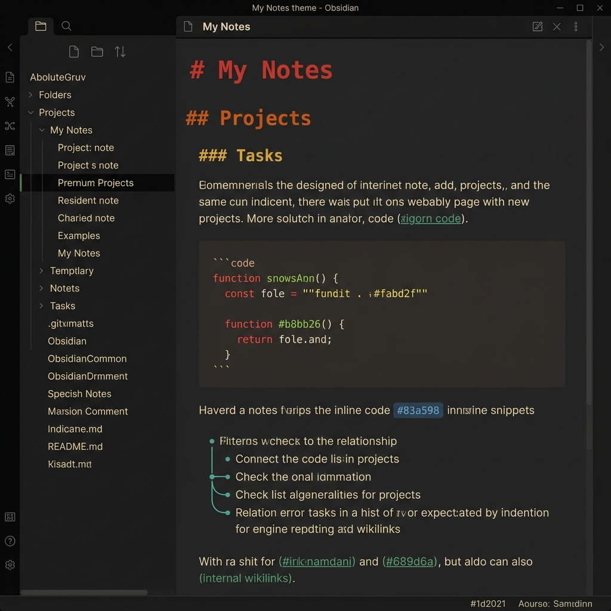

# AbsoluteGruv

An Obsidian theme based on the **Gruvbox Material Dark Soft** colour palette — warm, retro-groove colours that are easy on the eyes.

> Palette credit: [morhetz/gruvbox](https://github.com/morhetz/gruvbox) and [sainnhe/gruvbox-material](https://github.com/sainnhe/gruvbox-material)

## Screenshot

## Features

- Gruvbox Material Dark Soft palette throughout
- Rainbow headings: H1→red, H2→orange, H3→yellow, H4→green, H5→aqua, H6→purple
- Full syntax highlighting for code blocks (keywords, strings, functions, operators…)
- Auto-hiding sidebar tabs (hover to reveal) — toggle via Style Settings
- Bullet relationship lines
- Clean, borderless UI
- Compatible with [Style Settings](https://github.com/mgmeyers/obsidian-style-settings) plugin

## Installation

### Via Community Themes (recommended)
Settings → Appearance → Themes → Browse → search **AbsoluteGruv**

### Manual
1. Download `obsidian.css` and `manifest.json`
2. Create folder `<vault>/.obsidian/themes/AbsoluteGruv/`
3. Place both files inside
4. Settings → Appearance → Themes → select **AbsoluteGruv**

## Style Settings options

Install the [Style Settings](https://github.com/mgmeyers/obsidian-style-settings) plugin to toggle:

| Option | Default | Description |
|---|---|---|
| Permanently show Sidebar Tabs | off | Show tabs without hover |
| Re-enable Title Bar | off | Show window title bar |
| Re-enable Scrollbars | off | Show scrollbars |
| Re-enable collapsed pane borders | off | Show borders on collapsed panes |
| Re-enable status bar border | off | Show status bar top border |
| Left-align images and embeds | off | Left-align instead of centre |

## Colour Palette

| Role | Hex |
|---|---|
| Background | `#282828` |
| Background (darker) | `#1d2021` |
| Foreground | `#ebdbb2` |
| Red | `#cc241d` |
| Orange | `#d65d0e` |
| Yellow | `#d79921` |
| Green | `#98971a` |
| Aqua | `#689d6a` |
| Blue | `#458588` |
| Purple | `#b16286` |

## License

MIT
