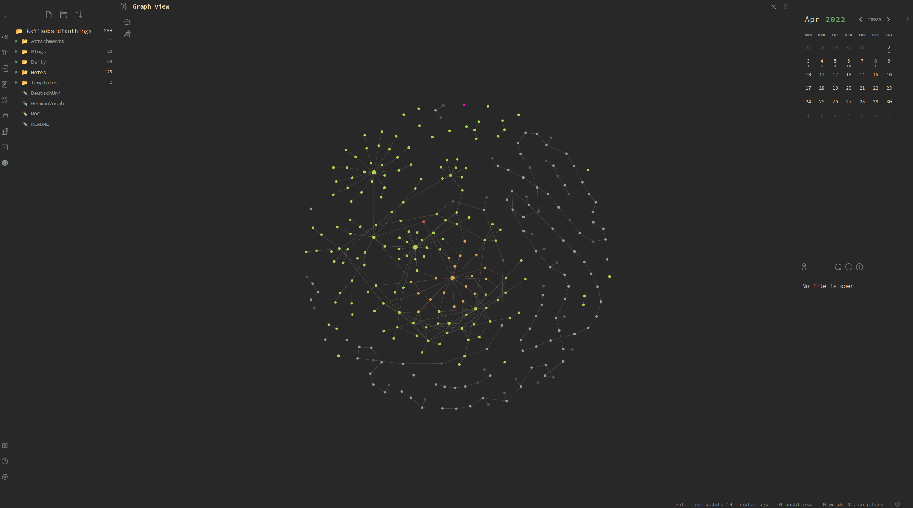

# ObsidianGruv
Obsidian theme as it exists in my `.obsidian` folder.

>**This theme is based on base gruvbox Palette by [morhetz](https://github.com/morhetz/gruvbox)**, for palette refer [Grubox Palette](https://github.com/morhetz/gruvbox#palette)

## Looks

## Usage
- Download `gruvme.css` file or clone the repo.
- Move/Copy `gruvme.css` to your obsidian vault's `.obsidian/themes` directory.
- Reload/Restart obsidian
- Goto `Settings > Appearance > Themes > Manage` to change current theme to `gruvme`. 
